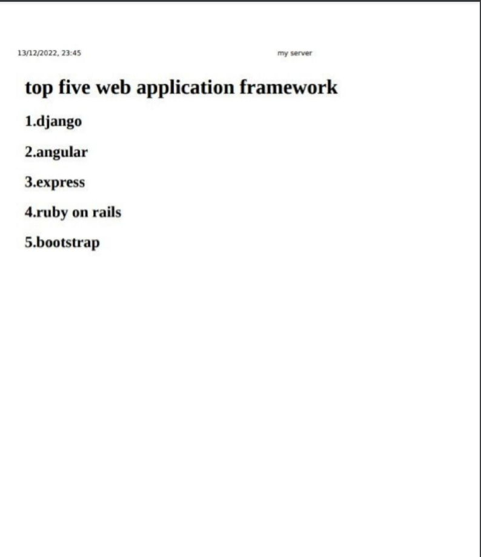

# Developing a Simple Webserver

# AIM:

Develop a webserver to display about top five web application development frameworks.

# DESIGN STEPS:

## Step 1:

HTML content creation is done

## Step 2:

Design of webserver workflow

## Step 3:

Implementation using Python code

## Step 4:

Serving the HTML pages.

## Step 5:

Testing the webserver

# PROGRAM:
```
from http.server import HTTPServer,BaseHTTPRequestHandler

content=

'''
<!doctype html>
<html>
<head>
<title>my Server</title>
</head>
<body>
<h1>top five web application frameworks</h1>
<h2>1.django</h2>
<h2>2.angular</h2>
<h2>3.express</h2>
<h2>4.ruby on rails</h2>
<h2>5.bootstrap</h2>
</body>
</html>

'''
from http.server import HTTPServer,BaseHTTPRequestHandler

content=

'''
<!doctype html>
<html>
<head>
<title>my Server</title>
</head>
<body>
<h1>top five web application frameworks</h1>
<h2>1.django</h2>
<h2>2.angular</h2>
<h2>3.express</h2>
<h2>4.ruby on rails</h2>
<h2>5.bootstrap</h2>
</body>
</html>
class MyServer (BaseHTTPRequestHandler):
    def do_GET(self):
        print("GET request recieved....")
        self.send_response(200)
        self.end_headers()
        self.wfile.write(content.encode())
print("this is my webserver")
server_address=('',80)
httpd=HTTPServer(server_address,MyServer)
httpd.serve_forever()
```

# OUTPUT:


# RESULT:

The program is executed succesfully
